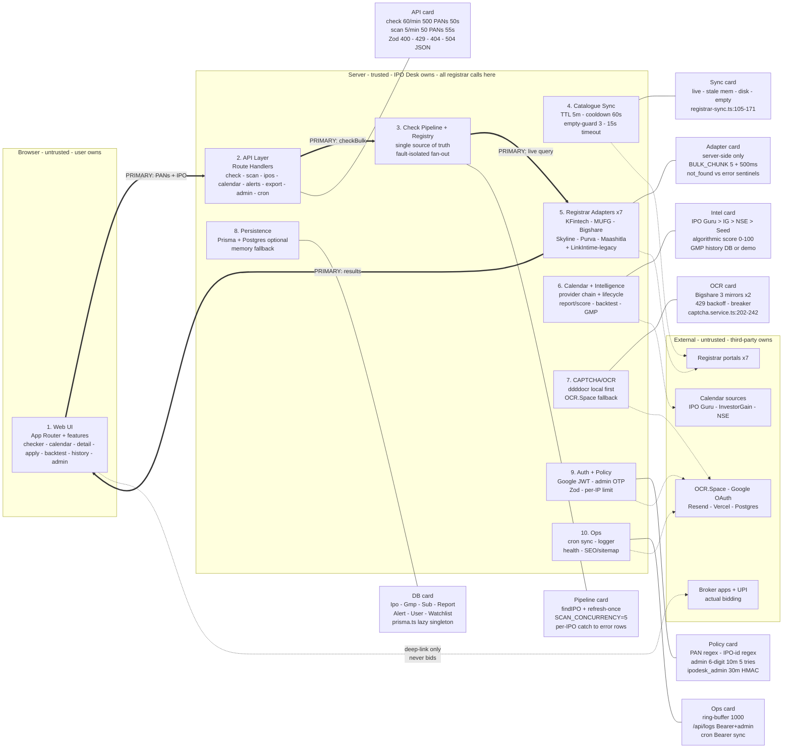

# IPO Desk (IPODESK) — Allotment Checker

Check IPO allotment status for single or multiple PANs instantly. Track IPO calendars, analyse GMP, view subscription data, manage a personal check history, coordinate family bids with a checklist, and backtest IPO strategies — all in one dark-themed dashboard.

All IPO data is discovered **dynamically from registrar APIs** — no hardcoded lists. The calendar uses live provider data (IPO Guru, InvestorGain, NSE) with curated sample fallback.

> Brand: canonical name is **IPO Desk**, alias **IPODESK** (no-hyphen form users type in Google). Single source of truth: `src/lib/siteConfig.ts` (`siteUrl`, `siteName`, `siteAlternateName`). The live deployment is `https://ipo-desk.vercel.app` unless `NEXT_PUBLIC_SITE_URL` is set.

---

## Features

### Allotment Checker
- **Single & Bulk PAN Check** — type one PAN, paste many, or upload Excel/CSV (max 5 MB)
- **Cross-IPO Scan** — check the same PANs across all active IPOs at once
- **Latest-first IPO sorting** — IPO selector ordered by allotment date (then open date), newest first
- **Results Dashboard** — sortable, filterable TanStack Table with pagination (10/25/50/100)
- **PAN Labels** — assign nicknames to PANs for easy identification in results
- **Share Card** — Canvas-generated PNG share card for allotment results
- **Export** — CSV & styled XLSX with summary sheet

### IPO Calendar
- **Live Clock & Auto-Refresh** — IST clock, 60-second polling, tab-focus refresh
- **Lifecycle Tabs** — All / Open / Upcoming / Closed / Listed with per-tab counts
- **Board Filter** — Mainboard / SME / All
- **Search & Sort** — search by name, sort by GMP, issue size, dates, subscription
- **Watchlist** — star IPOs to track, persisted in localStorage with cross-tab sync
- **Data Source Badge** — honest "Live" vs "Sample" indicator
- **Calendar Highlights** — at-a-glance stats (open count, top GMP, most subscribed)
- **Related-pages nav** — cross-links to Upcoming IPOs, GMP Today, Allotment Check, Family Checklist (internal SEO)

### IPO Detail Page
- **Key Stats** — price band, lot size, issue size, minimum investment
- **Subscription Bars** — QIB / NII / Retail / Total subscription multiples
- **GMP Analysis** — grey-market premium, estimated listing price, gain %
- **GMP Trend Chart** — Recharts area chart showing GMP history over time
- **AI Research Report** — algorithmic scoring engine with verdict, radar chart, and expandable sections (financial health, valuation, sentiment, risk)
- **IPO Score** — 0–100 composite score with per-category breakdown
- **Timeline** — visual stepper from open to listing
- **Issue Details** — registrar, lead managers, exchanges
- **Add to Calendar** — download `.ics` or add to Google Calendar
- **Alert Settings** — configure push alerts for IPO opens, GMP crossings, subscription milestones, and allotment declarations
- **Deep-Link to Checker** — one click to check allotment for this IPO

### Check History
- **Stats Cards** — total checks, PANs checked, allotted count, win rate
- **Entry List** — scrollable history with per-entry status badges
- **Remove / Clear** — delete individual entries or wipe all history

### Family Checklist (`/apply`)
- **Account Vault** — save family PANs, brokers, UPI IDs once (browser localStorage, never sent to server)
- **Apply Workspace** — pick an open IPO, set lots, tick who applies, see per-account + total blocked amounts
- **Copy helpers** — per-account Copy PAN/UPI/DP-ID plus `Copy all details` TSV for Excel/broker forms
- **Broker deep-links** — one-click `Open broker IPO pages` + per-account `Continue in <Broker>` (submission always happens in the broker's own app)
- **UPI mandate tracker** — per-IPO × account stepper (`not-started → applied → upi-pending → upi-approved → done + skipped`)
- Honesty guardrail: IPO Desk never places bids or moves money. One PAN = one bid (SEBI rule).

### Backtest (`/backtest`)
- **Strategy sliders** — Min GMP %, Min QIB/Retail/Total subscription, board, issue size
- **Presets** — High GMP Momentum, Institutional Conviction, SME Multibagger Hunt, Conservative Bluechip, All-Weather Filter
- **Metrics** — win rate %, avg listing-day gain %, ₹1L capital-growth simulation, benchmark comparison
- **Visuals + export** — return distribution chart, cumulative growth trajectory, searchable history table, CSV export, programmatic `/api/backtest`

### Auth (optional, app works without it)
- **Users** — Google OAuth via Auth.js v5 (JWT sessions); login unlocks cross-device alert ownership + watchlist linking
- **Admin** — passwordless email OTP (6-digit, hashed, 10-min expiry, rate-limited) issuing a short-lived `ipodesk_admin` cookie; `CRON_SECRET` Bearer still works for cron/programmatic access
- See [AUTH_PLAN.md](./AUTH_PLAN.md) for the implemented design.

### SEO
- **Landing pages** — `/ipo-allotment-check` (how-to + FAQ schema), `/ipo-gmp-today` (GMP guide + FAQ schema), `/upcoming-ipo` (live upcoming/open IPOs + ItemList); each with canonical + `en-IN`/`x-default` alternates, OG/Twitter cards, BreadcrumbList schema
- **Sitemap + robots** — dynamic `sitemap.xml` (static routes incl. the 3 landing pages + per-IPO entries with real `lastModified`, cached 1h via `revalidate`); `robots.ts` with per-bot allow rules for major search engines, crawl-delay for generic crawlers, sitemap reference
- **JSON-LD** — Organization schema (brand + `IPODESK` alias + logo) in root layout; WebSite + WebApplication schemas on homepage; FAQ/Breadcrumb/ItemList schemas on landing pages
- **Homepage hero** — server-rendered sr-only H1 + crawlable copy and feature links for Google, lazy-loaded client checker UI
- **Canonical brand config** — `src/lib/siteConfig.ts` (`NEXT_PUBLIC_SITE_URL` override, `en-IN` + `x-default` alternates, Google Search Console verification)
- **Perf/caching** — `optimizePackageImports`, browserslist targets, CLS logo fix, `poweredByHeader: false`, immutable 1y cache on `/_next/static`, 7-day cache on public icons/images (incorrect blanket `Cache-Control` headers removed)

### Technical
- **Live Multi-Registrar Discovery** — KFintech, MUFG Intime (ex Link Intime, plus legacy `linkintime` key), Bigshare, Skyline, Purva, Maashitla — all discovered dynamically
- **Fault Isolation** — each registrar syncs independently; one failing never hides others
- **Rate Limiting** — in-memory per-IP rate limiting on check/scan endpoints (`/api/check` at 60 req/min for bulk uploads)
- **Zod Validation** — all API inputs validated with detailed error responses
- **Structured Logging** — ring-buffer logger viewable at `/api/logs` (Bearer-guarded)
- **Server-Side Only** — all registrar API calls are server-side; client only talks to Next.js
- **Optional Database** — Prisma + Postgres for persistent IPO data, GMP history, and user alerts (graceful fallback when no DB configured)
- **Bigshare bulk speed** — local ddddocr OCR fast-path (Docker) with OCR.Space fallback, CAPTCHA pool pre-warm, sticky fastest-mirror, parallel frontend batches (×3) with progressive rendering — see [BIGSHARE_BULK_SPEED_PLAN.md](./BIGSHARE_BULK_SPEED_PLAN.md)

---

## Tech Stack

| Layer | Technology |
|---|---|
| Framework | Next.js 16 (App Router) |
| UI | React 19 + Tailwind CSS v4 + shadcn/ui |
| Table | TanStack Table v8 |
| Charts | Recharts (GMP trend, backtest analytics) |
| Command palette | cmdk (⌘K global search) |
| Auth | Auth.js v5 (Google OAuth, JWT sessions) + Resend email OTP for admin |
| Database | Prisma + Postgres (`@prisma/client`, `@prisma/adapter-pg`) — optional |
| Notifications | Sonner |
| Icons | Lucide React |
| HTTP | Axios |
| File Parsing | SheetJS (xlsx) |
| File Export | SheetJS (CSV) + ExcelJS (styled XLSX) |
| Validation | Zod |
| Tests | Vitest (57 tests across 7 suites) |
| PWA | Web app manifest (`standalone` mode) |

---

## Pages

| Route | Description |
|---|---|
| `/` | Allotment checker — single/bulk/excel check, results dashboard, cross-IPO scan (server-rendered SEO hero + client checker) |
| `/ipo-allotment-check` | SEO guide — how to check allotment by PAN per registrar, FAQ schema |
| `/ipo-gmp-today` | SEO page — GMP today guide, FAQ + Breadcrumb schemas |
| `/upcoming-ipo` | SEO page — upcoming + open IPOs 2026 from live calendar, ItemList schema |
| `/calendar` | IPO calendar — live data, lifecycle tabs, search, sort, watchlist |
| `/ipo/[id]` | IPO detail — key stats, subscription, GMP, timeline, add to calendar, research report, apply CTA |
| `/apply` | Family IPO checklist — account vault, apply workspace, mandate tracker |
| `/backtest` | Strategy backtesting engine with presets, metrics, charts, CSV export |
| `/history` | Check history — stats, per-entry list, remove/clear |
| `/admin` | Admin console — OTP-gated sync monitor + log viewer + IPO registry + report reviewer |

## API Endpoints

| Endpoint | Method | Description |
|---|---|---|
| `/api/check` | POST | Check allotment for 1–500 PANs on a single IPO (60 req/min, Bigshare CAPTCHA-aware) |
| `/api/scan` | POST | Check PANs against all active IPOs (max 50 PANs, all 7 registrars) |
| `/api/ipos` | GET | List active IPOs merged across all registrars |
| `/api/calendar` | GET | IPO calendar data with lifecycle derivation |
| `/api/backtest` | GET/POST | Programmatic strategy simulation |
| `/api/bigshare/captcha` | GET | Bigshare CAPTCHA image proxy/solver support |
| `/api/export` | POST | Download results as CSV or XLSX |
| `/api/logs` | GET | Debug event logs, Bearer-guarded (admin cookie or `CRON_SECRET`) |
| `/api/health` | GET | Health + config flags (auth/mail/allowlist, OCR availability) |
| `/api/alerts` | GET/POST/DELETE | Manage IPO alerts (user session or `x-device-id`) |
| `/api/alerts/link` | POST | Link anonymous device alerts to a signed-in user |
| `/api/auth/[...nextauth]` | GET/POST | Auth.js routes (Google OAuth) |
| `/api/admin/otp/request` | POST | Request admin email-OTP code (allowlisted identifiers only) |
| `/api/admin/otp/verify` | POST | Verify OTP, issue `ipodesk_admin` cookie |
| `/api/admin/logout` | POST | Clear admin session |
| `/api/admin/sync` | POST | Manual registrar sync trigger (admin cookie or `CRON_SECRET` Bearer) |
| `/api/ipo/[id]/gmp-history` | GET | GMP time-series data for trend chart (DB when available, demo fallback) |
| `/api/ipo/[id]/report` | GET | AI research report with scores and verdict |
| `/api/cron/sync-ipos` | GET | Vercel Cron daily sync (Bearer `CRON_SECRET`), persists snapshots when DB is configured |

---

## Getting Started

```bash
npm install
npm run dev
# → http://localhost:3000
```

No environment variables required — all registrar APIs are public. Optional:

| Variable | Description |
|---|---|
| `NEXT_PUBLIC_SITE_URL` | Canonical site URL for metadata/sitemap/JSON-LD (defaults to `https://ipo-desk.vercel.app`) |
| `IPOGURU_API_KEY` | Enables IPO Guru as the live calendar data source |
| `CRON_SECRET` | Protects `/api/cron/sync-ipos`, `/api/logs`, `/api/admin/sync` (Bearer) |
| `DATABASE_URL` | Enables Postgres persistence (otherwise in-memory fallback) |
| `OCR_SPACE_API_KEY` | Bigshare CAPTCHA OCR quota (25k/mo free; else shared demo key) |
| `AUTH_SECRET`, `GOOGLE_CLIENT_ID`, `GOOGLE_CLIENT_SECRET` | Enables Google sign-in (Auth.js v5) |
| `ADMIN_EMAILS`, `ADMIN_PHONES` | Allowlisted admin OTP identities |
| `RESEND_API_KEY`, `RESEND_FROM` | Admin email-OTP delivery |

See [.env.example](./.env.example) for the full annotated list.

---

## Registrar Integrations

Every IPO is checked through the same `RegistrarAdapter` interface. All integrations use the registrars' own public endpoints — no Playwright or headless browser needed.

| Registrar | Discovery | Allotment Check |
|---|---|---|
| **KFintech** | SPA bundle scrape from `ipostatus.kfintech.com` | `GET .../prod/api/query?type=pan` |
| **MUFG Intime** (ex Link Intime) | `POST /Initial_Offer/IPO.aspx/GetDetails` | `POST /Initial_Offer/IPO.aspx/SearchOnPan` |
| **Link Intime (legacy key)** | Same MUFG portal family | Same portal (kept as separate key for back-compat) |
| **Bigshare** | HTML `<select>` scrape from `IPO_Status.html` (+ mirrors) | `POST /Data.aspx/FetchIpodetails` + CAPTCHA (local ddddocr fast-path, OCR.Space fallback) |
| **Skyline** | IPO `<select>` list scrape | 2-step session POST (CSRF token + search), no CAPTCHA |
| **Purva Sharegistry** | Django IPO query page | Django CSRF session flow, PAN mode |
| **Maashitla** | `GET /api/public-issue/companies` (public OpenAPI JSON) | `GET /api/public-issue/search?company_name=&pan=` (HTTP 404 = `not_found`) |

Allotment checks always hit the registrar live per request. IPO catalogues are cached for 5 minutes with stale-cache and disk-snapshot fallbacks.

---

## Calendar Data Providers

| Provider | API Key | Data |
|---|---|---|
| **IPO Guru** | Required (`IPOGURU_API_KEY`) | Full IPO data + GMP + subscription |
| **InvestorGain** | None | GMP, dates, price band, lot size, category |
| **NSE India** | None | Official NSE/BSE issue data (no GMP) |
| **Seed** (fallback) | None | 10 curated IPOs with dynamic dates |

Providers are tried in priority order; the first to return data wins. If all live sources fail, the curated seed ensures the calendar is never empty.

---

## Project Structure

```
src/
  app/
    api/               # Route handlers (check, scan, calendar, export, logs, health, ipos, backtest, bigshare/captcha, alerts, auth, admin, cron)
    admin/page.tsx     # Admin console (OTP-gated)
    apply/page.tsx     # Family IPO checklist
    backtest/page.tsx  # Strategy backtesting engine
    calendar/page.tsx  # IPO calendar page
    history/page.tsx   # Check history page
    ipo/[id]/page.tsx  # IPO detail page
    page.tsx           # Home — server SEO hero + client allotment checker
    sitemap.ts         # Dynamic sitemap (static routes + per-IPO URLs)
    robots.ts          # Robots rules + sitemap reference
  components/
    auth/              # AuthSessionProvider, AuthButton
    common/            # Header, CommandPalette, StatusBadge
    ui/                # shadcn primitives (badge, button, card, input, tabs, etc.)
  features/
    ipo-apply/         # AccountVault, ApplyWorkspace, ApplyChecklist, brokers, apply-store
    backtest/          # Backtest workspace, strategy engine, historical dataset
    ipo-checker/       # CheckerTabs, IPOSelector, ResultsDashboard, ScanResultsDashboard
    ipo-calendar/      # Calendar view, cards, highlights, providers, format utils, ICS
    ipo-detail/        # Subscription bars, timeline, add-to-calendar, research report
  hooks/               # useWatchlist, usePanLabels, useCheckHistory, useApplyAccounts, useAlerts
  lib/
    siteConfig.ts      # Canonical site URL + brand identity (siteUrl, siteName, siteAlternateName)
    utils.ts           # cn() helper
  registrars/          # RegistrarAdapter interface + KFintech, MUFG, Link Intime, Bigshare, Skyline, Purva, Maashitla adapters
  services/            # check pipeline, registrar sync, KFintech sync, captcha solver, export, logger, report, backtest
  types/               # Allotment, IPO, calendar, API type definitions
```

---

## Roadmap

See [ROADMAP.md](./ROADMAP.md) for completed phases and what's next. Key plans: [plan.md](./plan.md) (registrar expansion — Skyline/Purva/Maashitla live, Cameo/Beetal/MCS deferred), [AUTH_PLAN.md](./AUTH_PLAN.md) (implemented auth design), [MULTI_APPLY_PLAN.md](./MULTI_APPLY_PLAN.md) + [FAMILY_CHECKLIST_PLAN.md](./FAMILY_CHECKLIST_PLAN.md) (family checklist), [BIGSHARE_BULK_SPEED_PLAN.md](./BIGSHARE_BULK_SPEED_PLAN.md) (bulk-upload performance).

---

## Architecture — Archify High-Level (evidence-based)

> 10 core runtime components. One primary path is bold. Detail lives in cards, not extra edges.



Primary request path: `Investor → C1 Checker UI → C2 /api/check → C3 pipeline/registry → C5 adapter → E1 live registrar → C1 results/export`.

Trust boundaries: `B1 browser` never calls registrars directly (`README:83`, server-side only); `B2 server` validates everything (Zod + rate-limit + timeouts); `B3 external` treated as flaky (retry + fallback + fault isolation); `B1→B2→B3` only. Admin/ops gated by OTP + `CRON_SECRET` Bearer (`admin-auth.ts`, `logs/route.ts:11-23`). Family vault stays in `localStorage`, never sent to server (`ApplyWorkspace.tsx:236`).

---

## Tool-Call Loop — Archify Workflow (evidence-based)

> Scope note: this repo has **no autonomous agent tool-call loop**. What exists is a
> **request-driven check pipeline** (`/api/check`, `/api/scan` → `registrar.service.ts` →
> `RegistrarAdapter`). The lanes below map that real loop. Nothing here is invented —
> every edge has a code reference.

```mermaid
flowchart TB
  subgraph L1[User surface]
    U1[Checker UI<br/>CheckerTabs + IPOSelector<br/>src/app/client-page.tsx]
    U2[Bulk batching<br/>20 PANs x 3 parallel<br/>progressive render<br/>src/app/client-page.tsx:31-32,44-121]
    U3[Family checklist<br/>manual UPI stepper<br/>broker deep-links only<br/>ApplyWorkspace.tsx:206,236]
  end
  subgraph L2[Agent runtime = request runtime]
    R1[/api/check POST<br/>60/min - 500 PANs max<br/>50s timeout<br/>src/app/api/check/route.ts:10,53-67,100-105/]
    R2[/api/scan POST<br/>5/min - 50 PANs max<br/>55s timeout<br/>src/app/api/scan/route.ts:10,48-54,85-90/]
    R3[checkAllotment / scanAllotment<br/>findIPO + registry fan-out<br/>SCAN_CONCURRENCY=5<br/>src/services/registrar.service.ts:46-66,78-122]
    R4[catalogue sync<br/>TTL 5m - cooldown 60s<br/>empty-guard 3 - timeout 15s<br/>src/services/registrar-sync.ts:19-33]
  end
  subgraph L3[Policy boundary]
    P1[Zod PAN + IPO-id validation<br/>400 on fail<br/>check/route.ts:47-67 - scan/route.ts:42-54]
    P2[per-IP rate limit<br/>check: / scan: namespaces<br/>429 + retry message<br/>rate-limit.ts:25-43 - check/route.ts:71-76]
    P3[admin gate<br/>allowlist + 6-digit OTP<br/>10m expiry - 5 tries<br/>30m HMAC cookie<br/>admin-auth.ts:15-22,265-335]
    P4[logs gate<br/>CRON Bearer OR admin cookie<br/>else 401<br/>api/logs/route.ts:11-23]
  end
  subgraph L4[Tool execution]
    T1[RegistrarAdapter interface<br/>getActiveIPOs + checkBulk<br/>adapter.interface.ts:5-33]
    T2[7 adapters<br/>KFintech - MUFG - Bigshare<br/>Skyline - Purva - Maashitla<br/>+ LinkIntime-legacy]
    T3[Bigshare CAPTCHA tool<br/>ddddocr local first<br/>OCR.Space fallback<br/>captcha.service.ts:202-242]
  end
  subgraph L5[Exception handling]
    H1[withRetry<br/>4 tries - 429/5xx only<br/>exp backoff<br/>shared.ts:27-49]
    H2[bulkCheck isolation<br/>Promise.allSettled<br/>invalid PAN = error no call<br/>shared.ts:64-108]
    H3[per-IPO isolation<br/>catch to error rows<br/>never aborts scan<br/>registrar.service.ts:92-97]
    H4[fallback chain<br/>live - stale mem - disk - empty<br/>plus per-batch partial results<br/>registrar-sync.ts:105-171 - client-page.tsx:76-85]
  end
  subgraph L6[Observability - evidence path]
    O1[ring-buffer logger<br/>1000 entries<br/>logger.service.ts:26-58]
    O2[/api/logs<br/>event + limit filter<br/>Bearer-guarded<br/>logs/route.ts:25-33]
    O3[admin SyncMonitor + LogViewer<br/>5s refresh - level filters<br/>SyncMonitor.tsx - LogViewer.tsx]
  end

  U1 --> U2 --> R1
  U1 --> R2
  U3 -.->|approval is manual UPI in broker/UPI app<br/>never auto-bid| R1
  R1 --> P1 --> P2 --> R3
  R2 --> P1 --> P2 --> R3
  R3 --> R4 --> T1 --> T2
  T2 --> T3
  T3 --> H1 --> H2 --> H3 --> H4
  H4 --> O1 --> O2 --> O3
  P2 -.->|blocked 429| U2
  P1 -.->|blocked 400/404| U1
  P3 -.->|blocked 401| O2
  P4 -.->|blocked 401| O2
  H1 -.->|retry| T2
  H4 -.->|retry list + partial render| U2
```

Successful path (primary): `Checker UI → /api/check → Zod + rate-limit pass → checkAllotment → registry adapter → live registrar → bulkCheck isolate → JSON + summary → progressive render + history/export`.

Approval path (manual only, no agent auto-approve): UPI mandate stepper `not-started → applied → upi-pending → upi-approved → done + skipped` (`apply-store.ts:4-15`); `Open broker IPO pages` + `Continue in <Broker>` deep-links (`ApplyWorkspace.tsx:206`); guardrail `IPO Desk never places bids or moves money` (`ApplyWorkspace.tsx:236`); admin OTP `createChallenge` / `verifyChallenge` + `ipodesk_admin` cookie (`admin-auth.ts:177-257,265-335`).

Retry path: `withRetry` 429/500/502/503/504 only (`shared.ts:39-45`); Bigshare 3 mirrors × 2 attempts + one CAPTCHA refresh (`bigshare.ts:200-270`); OCR 429 one backoff then parallel fallback engines (`captcha.service.ts:150-187`); sync cooldown 60s + empty-guard 3 (`registrar-sync.ts:24-28`).

Blocked path: `429 Too many requests/scans` (`check/route.ts:72-75`, `scan/route.ts:57-61`); `400 Validation failed` + `404 IPO not found` (`check/route.ts:87-121`); `504 timeout` always JSON never hang (`check/route.ts:112-116`); `401 Unauthorized` on `/api/logs` (`logs/route.ts:21-22`); invalid PAN short-circuits to `error` without upstream call (`shared.ts:76-80`); `not_found` sentinels never become `error` (`bigshare.ts:273-289`).

Evidence path: `log(level, event, message, {durationMs, meta})` (`logger.service.ts:32-58`) with events `ipo_sync_*`, `pan_check_*`, `api_response_time`; mirrored to console + ring buffer; surfaced via Bearer/admin-guarded `/api/logs` and admin LogViewer/SyncMonitor.

Unknowns (not invented): no autonomous planning, tool-approval gate, or push-delivery worker exists in code — alerts are CRUD + local hook only (`/api/alerts`, `useAlerts.ts`); multi-instance rate-limit/OTP-hourly ledger are best-effort in-memory (`rate-limit.ts:1-6`, `admin-auth.ts:88-94`).

---

## License

MIT
